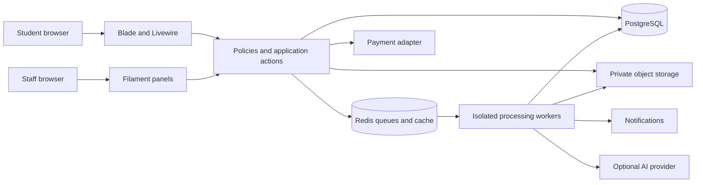
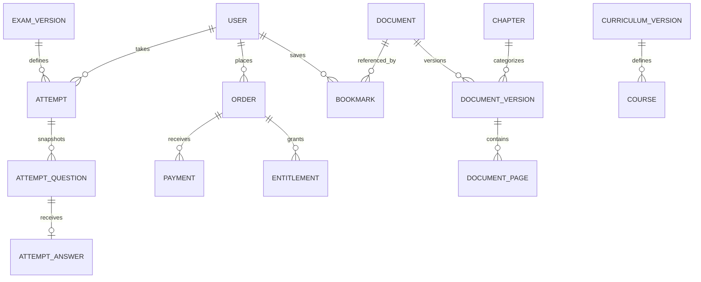

# Technical architecture and implementation specification

Status: proposed architecture; dependencies have not been installed and compatibility has not been exercised in this repository.

## 1. Stack and boundaries

| Layer | Proposed choice | Reason / verification |
|---|---|---|
| Runtime/framework | PHP 8.3+ and Laravel 13 | Laravel 13 requires PHP 8.3 minimum. Pin an actively supported PHP version in the deployment image. [Laravel release notes](https://laravel.com/docs/13.x/releases) |
| Staff interface | Filament 5 | Use resources, forms, tables, actions and widgets for administration. Current docs specify PHP 8.2+, Laravel 11.28+, Tailwind 4.1+. [Filament installation](https://filamentphp.com/docs/5.x/introduction/installation) |
| Student interface | Blade + Livewire 4 + Alpine | Custom, server-rendered learning flows; isolated client behavior for reader and countdown. [Livewire installation](https://livewire.laravel.com/docs/4.x/installation) |
| CSS/build | Tailwind 4.1+ with Vite | Shared semantic tokens, compiled production CSS. [Tailwind Laravel guide](https://tailwindcss.com/docs/installation/framework-guides/laravel/vite) |
| Primary database | PostgreSQL | Transactional business records and optional later vector retrieval; MySQL is possible if operational familiarity outweighs that advantage |
| Cache/queues | Redis | Separate worker pools for payments, ingestion, notifications and optional AI |
| Files | Private S3-compatible object storage | Separate quarantine, originals, private derivatives and permitted public previews |
| Search | PostgreSQL full-text initially | Benchmark Nepali tokenization and mixed-language aliases; move to a dedicated engine if measured results justify it |
| Payments | One eSewa or Khalti adapter at launch | Pick based on merchant onboarding and sandbox access; add the other through the same interface |
| Monitoring | Structured logs, error tracker, uptime checks and queue metrics | Correlation IDs and alerts tied to operational actions |

These major versions are a candidate set based on current official documentation. The implementation spike must resolve Composer/npm dependencies, check Livewire/Filament constraints and third-party plugins, and build assets before the team commits to exact versions. Commit lockfiles. Do not assume older Filament examples or plugin versions work unchanged.

Choose a modular monolith to keep transactions and deployment manageable. Filament is the administration surface; students use purpose-built Blade/Livewire pages. Both call the same actions and policies. Avoid creating a separate REST API just to serve the Livewire interface. Add versioned API endpoints later for actual native or institutional consumers.



## 2. Suggested application structure

```text
app/
  Actions/
    Content/{SubmitDocument,ApproveDocument,WithdrawDocument}.php
    Learning/{StartAttempt,SaveAnswer,SubmitAttempt,ScoreAttempt}.php
    Billing/{CreateOrder,VerifyPayment,GrantEntitlement,RefundOrder}.php
  Contracts/PaymentGateway.php
  Services/{Search,DocumentAccess,CurriculumMapping}/
  Integrations/Payments/{EsewaGateway,KhaltiGateway}.php
  Jobs/{ScanDocument,RenderDocument,ExtractText,ReconcilePayment}.php
  Livewire/{Dashboard,Library,Reader,Practice,Checkout,Account}/
  Filament/Resources/
  Models/
  Policies/
  Enums/
resources/views/{components,livewire,layouts}/
tests/{Feature,Unit,Browser}/
```

Start with ordinary Laravel conventions; domain folders are organizational, not independent services. Keep irreversible or concurrency-sensitive changes out of model observers and presentation components. Dispatch side effects after transaction commit; use an outbox when a required external effect must survive a crash between commit and dispatch.

## 3. Data model

Use foreign keys, UTC timestamps, application-visible opaque IDs where appropriate, explicit status enums, and audit fields. Monetary values are integer paisa with currency `NPR`; convert only within provider adapters. Dates displayed in Asia/Kathmandu. Store a separate calendar/year field for academic labels; do not infer BS dates by subtracting a fixed offset.

| Table/group | Important fields and constraints |
|---|---|
| users, profiles | email unique, verified_at, password hash, locale, display_name, status; profile academic preferences |
| roles, permissions, role_user | staff scopes and permissions; seed least-privilege roles |
| institutions, institution_memberships | P2; institution/user unique; role and membership status |
| programs, curriculum_versions | code unique; source_url, effective_from, archived_at; version belongs to program |
| courses, subjects, course_subjects | grade/course under curriculum version; unique course/subject; subject aliases |
| chapters, learning_outcomes | course_subject_id, code, order, localized title; outcome-to-chapter relation |
| user_subjects | unique user/course_subject; active flag |
| documents | owner_id, current_published_version_id, status, slug, visibility, access_tier |
| document_versions | document_id, version_number unique together; title, description, language, chapter_id, type, calendar, academic_year, page_count, status |
| document_assets | version_id, storage_key, kind, mime, bytes, checksum, scan_status; never expose raw storage keys as public URLs |
| document_pages | version_id/page_number unique; private extracted text, approved preview text, OCR confidence, derivative reference |
| rights_records | document_version_id, owner/source, permission evidence key, allowed uses, expiry, reviewer |
| content_reviews | version_id, reviewer_id, decision, reason, reviewed_at; reject author=self |
| bookmarks | user_id/document_id unique |
| content_reports | reporter_id, resource reference, category, status, assignee, resolution |
| questions, question_versions | immutable prompt/options/key/rubric, type, marks, outcome_id, reviewer, publication status |
| exams, exam_versions | syllabus reference, instructions, duration, published_at, scoring_policy; definition immutable once used |
| exam_version_questions | exam_version_id/question_version_id, position, marks override; checked totals |
| attempts | user_id, exam_version_id, state, starts_at, deadline_at, submitted_at, grading_status; one active attempt per applicable policy |
| attempt_questions | attempt_id, question_version_id, order and option-order snapshot |
| attempt_answers | attempt_question_id unique; answer payload, revision, saved_at; server-scored fields private |
| attempt_results | attempt_id unique, objective_marks, subjective_marks nullable, possible_marks, scoring_version, graded_at |
| products, product_versions | scope, duration, currency, amount, published status; orders reference immutable offer version |
| orders, order_items | user_id, public_reference unique, status, currency, total_paisa; immutable item snapshots |
| payments | order_id, provider, provider_reference unique per provider, amount_paisa, state, verified_at |
| payment_events | provider/event_key unique; payload digest, minimal redacted metadata, processing outcome |
| entitlements | user_id, source_order_item_id, scope, starts_at, ends_at, revoked_at; unique grant key |
| refunds | payment_id, amount_paisa, reason, approval_actor, provider_reference, state |
| support_tickets, audit_logs | actor/resource, action, timestamp, correlation_id; sensitive values redacted |
| outbox_events | event_type, aggregate_id, payload, published_at, retry_count |
| notifications | user_id, category, read_at; separate preference/consent records |
| credit_ledger, credit_allocations | P1; append-only deltas, source_event unique, expires_at; allocations connect spends to earned lots |
| document_unlocks | P1; user_id/version_id unique, source, granted_at, revoked_at |
| tutor_requests, tutor_assignments, tutor_answers | P1; owner, subject, reservation reference, state, assignee, private attachments, answer versions |
| ai_conversations, ai_messages, ai_usage | P1; owner, authorized resource scope, provider/model, tokens/cost, retention deadline |
| document_chunks, chunk_embeddings | P1; version/page references, visibility, embedding version; remove on withdrawal/deletion |

Important indexes: published document status plus curriculum/chapter/type; bookmarks user/time; attempts user/start time; orders user/status; pending payments status/created time; ledger user/expiry; report status/assignee; unique idempotency and provider references. Review actual query plans before adding broad indexes.



## 4. Access contract

`DocumentAccess::canRead(user, documentVersion)` checks publication/withdrawal, applicable rights, public/free status and active entitlement or explicit unlock. `canDownload` adds download permission. Check at request time, on every Livewire action, on derivative delivery and before AI retrieval. Do not trust client IDs, hidden buttons, cached role flags or Livewire public properties.

For sensitive documents, stream through an authorized endpoint. If short-lived signed object URLs are used, define a small expiry and recognize that an already issued URL can remain usable until expiry. Immediate revocation requires an authorized proxy or corresponding object invalidation. Public CDN caches may hold only intentionally public previews.

Future institutional membership scopes must be checked in queries, policies, exports, notifications and jobs. Institution IDs from the browser are not proof of membership.

## 5. Routes and component responsibilities

| Route | Responsibility / authorization |
|---|---|
| `/` | Public landing and curriculum discovery |
| `/library?q=&subject=&chapter=&type=` | Published, access-safe search results; shareable filters |
| `/subjects/{slug}` | Curriculum-specific hub; redirect aliases canonically |
| `/resources/{document:slug}` | Metadata and permitted preview/full reader |
| `/resources/{document}/download` | Authenticated policy-checked download |
| `/dashboard`, `/saved`, `/account` | Current user's data only |
| `/practice/{exam}` | Published exam introduction and access check |
| `/attempts/{attempt}` | Owner-only active runner or result redirect |
| `/attempts/{attempt}/result` | Owner/staff-assigned review; answer release policy |
| `/plans`, `/checkout/{product}` | Offer display; order creation protected from CSRF |
| `/payments/{provider}/return` | Verify external return, display current order status |
| `/payments/{provider}/notify` | Only if provider supports it; provider-specific verification |
| `/uploads`, `/my-uploads` | P1 verified contributor workflows |
| `/ask`, `/questions/{request}` | P1 authorized AI/tutor workflows |
| `/stnapanel` | Filament staff panel, MFA and policies |

Use server-side validation, pagination and loading/error states. Debounce search; validate long-form inputs on blur/submit when per-keystroke requests add little value. Use Alpine for tabs, local menus and countdown display. Do not send an exam timer request every second. Integrate PDF rendering with an isolated component boundary so Livewire DOM morphing does not reset the viewer.

## 6. Transaction and state-machine rules

### Payment

`created → pending → paid`, with failed/canceled/expired alternatives. Refunds use separate records and explicit partial/full state. Do not rewrite successful payment history when refunding.

1. Recompute price and currency from the server's product version; create order with idempotency key.
2. Initiate payment using server credentials; store provider reference before redirect.
3. Treat the browser return as a signal to verify. eSewa documents signature/status mechanisms; Khalti provides a lookup endpoint and explicitly recommends final verification. [eSewa ePay](https://developer.esewa.com.np/pages/Epay), [Khalti checkout and lookup](https://docs.khalti.com/khalti-epayment/)
4. Verify provider status, reference, order identity and exact amount through the adapter. Never use a shared generic signature routine across both providers.
5. In a database transaction, lock the order, detect prior paid event, mark paid, grant exactly one entitlement and create an outbox event.
6. Send receipt after commit. Reconcile pending transactions on a schedule; preserve unknown states for retry/support.

Do not assume either gateway supplies recurring mandates or generic webhooks. Cashier should not be treated as an eSewa/Khalti integration. Merchant fees, refund support and production credentials must be confirmed with the selected provider.

### Document ingestion

Store upload in quarantine → scan → parse/render in isolated worker → extract text/OCR → duplicate candidate check → human review → transactional publication → after-commit indexing. Each job checks document version and expected state; jobs are idempotent. Only scan-success assets may reach review/publication. Conversion workers have memory, CPU, page, runtime and network restrictions.

### Assessment

Start action locks applicable attempt slot, snapshots published version, sets deadline and returns answer-key-free questions. Save action authorizes owner, checks state/deadline and monotonically increasing revision. Submit action locks attempt, finalizes once and scores against snapshotted keys. Deadline worker calls the same finalization action. Subjective review produces a new grade record/audit event, not a hidden overwrite.

### Credit spending, P1

Lock the user's spendable balance/lots, remove expired availability, check existing unlock, allocate credit against valid lots and create unique unlock in one transaction. Reward events and reversals have unique source keys. Cache balance for display only; database ledger is authoritative.

## 7. Filament administration

Navigation groups: Academics, Content, Assessments, People, Commerce, Support, Operations. Resources include curricula/chapters, documents/reviews, question bank/exam versions, users/roles, products/orders/payments/refunds, reports/tickets and audit logs.

Use custom actions for Approve, Request revision, Withdraw, Retry processing, Reconcile payment and Approve refund. Each invokes an application action and policy. Financial rows are not freely editable forms. Require a reason for withdrawal/refund/role changes. Prevent bulk publication when any item lacks completed rights/quality review.

Dashboard widgets: review backlog age, failed jobs, pending payments, published content by chapter, support queue and verified revenue totals. Empty or insufficient data must be labelled; do not seed production with marketing metrics.

## 8. Search, AI and content privacy

Public search indexes only approved preview text and public metadata. Authorized full-text retrieval is a separate query path with access filters. For AI, filter candidate chunks by authorization before sending context to a provider, then recheck the final retrieved set. An embedding similarity match is not an access decision.

Bound chat context and output, record provider usage, and reserve user quota before dispatch. Release/adjust reservation after completion or failure. Strip personal identifiers where unnecessary. Define provider retention/training settings contractually before enabling private uploads. Withdrawn material must leave search and vector retrieval promptly; authorization checks cover index lag.

## 9. Security, data lifecycle and operations

Require HTTPS, secure/HttpOnly/SameSite cookies, CSRF protections, server authorization, output escaping, sanitized rich text, rate limiting and secret management. Render user files from a separate origin or isolated reader. Do not log tokens, passwords, payment secrets, full private documents or raw AI chats. Prevent server-side URL fetching to internal networks if remote imports are ever added.

Proposed retention policy for review: purge rejected uploads after 30 days; short-lived private AI conversation retention default 30 days; purge abandoned temporary uploads within 24 hours; expire delivery links within minutes. Financial/audit retention must be set after local requirements are reviewed. Deletion jobs remove derivative files, search/vector entries and personal profile data while retaining only justified financial records. Record backup expiry and restoration behavior so deleted data is not accidentally restored permanently.

Deployment: staging and production isolated; application process, scheduler and queue workers supervised separately; immutable asset build; database migration step; health checks; queue restart after release; automatic failure alert. Separate worker capacity for payment jobs so OCR cannot starve commerce. Store files outside ephemeral server disks.

Proposed backup goals: database daily backup plus point-in-time recovery for 15-minute RPO where supported; object versioning/backup policy; restore drill before launch; RTO four hours. These are targets requiring infrastructure validation. Use expand/contract migrations and a documented rollback procedure; application rollback must not assume destructive migrations are reversible.

## 10. Verification plan

| Test group | Required evidence |
|---|---|
| Authorization | Guest/student/staff ownership matrix; ID tampering; direct Livewire calls; revoked membership/entitlement; paid preview leakage |
| Content | Malformed/encrypted/oversized/malicious PDFs; failed scan/OCR; repeated jobs; self-approval; withdrawal across file/search/AI paths |
| Payments | Sandbox success/failure/pending/cancel; wrong amount/reference; repeated/reordered callbacks; timeout after provider success; reconciliation; partial refund |
| Assessment | Simultaneous save/submit, stale revision, disconnect/reconnect, refresh, browser closure at deadline, duplicate finalizer, immutable keys, subjective pending state |
| Credits, P1 | Concurrent spending, duplicate approval, expiry boundary, reversal after spending |
| AI, P1 | Unauthorized retrieval, prompt injection in documents, missing citations, provider timeout, cost limit, deletion |
| UX | Keyboard, screen-reader smoke test, phone landscape, 200% zoom, slow network, Nepali/math rendering, empty/error/loading states |
| Performance | Seed realistic corpus; target 100 concurrent browse users and 30 active exam users initially; measure and revise capacity assumptions |
| Recovery | Restore backup to staging, payment replay, queue replay, rollback drill |

Use focused unit tests for scoring/entitlements, feature tests for actions/policies and browser tests for critical journeys. Required CI: dependency install from lockfiles, style/static checks, tests, asset build and dependency audit. The documentation/prototype delivery has not executed these application tests because the application is not yet implemented.
